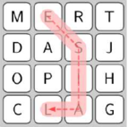
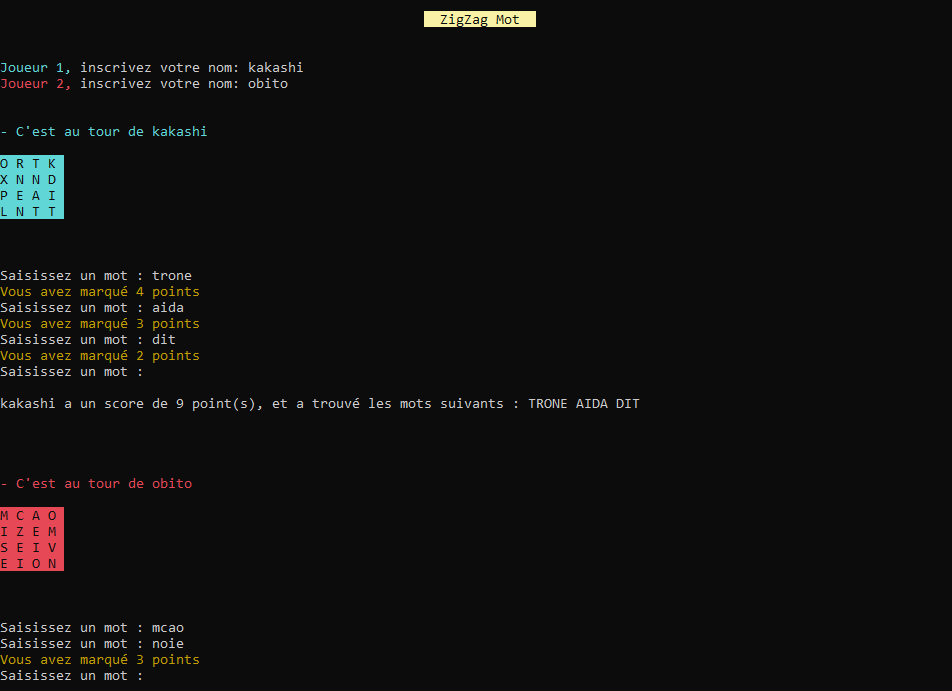

# zigzag-mot
## Présentation du problème
Le jeu commence par le mélange d’un plateau (carré) de [16 dés à 6 faces](./EL_MERSHATI_Laith_Problème/bin/Debug/Des.txt). Chaque dé possède une
lettre différente sur chacune de ses faces. Les dés sont lancés sur le plateau 4 par 4, et seule leur face
supérieure est visible. Le lancement du dé est traduit par un tirage aléatoire d’une face parmi les
6 d’un dé et ce pour tous les dés. Après cette opération, un compte à rebours de N minutes est lancé
qui établit la durée de la partie.

Chaques joueurs jouent l’un après l’autre pendant un laps de temps de 1 mn.

Chaque joueur cherche des mots pouvant être formés à partir de lettres adjacentes du plateau. Par
adjacentes, il est sous-entendu horizontalement, verticalement ou en diagonale. Les mots doivent
être de 3 lettres au minimum, peuvent être au singulier ou au pluriel, conjugués ou non, mais ne
doivent pas utiliser plusieurs fois le même dé pour le même mot. Les joueurs saisissent tous les mots
qu’ils ont trouvés au clavier. Un score par joueur est mis à jour à chaque mot trouvé et validé.

Le calcul de points se fait de la manière suivante : Un mot n’est accepté qu’une fois au cours du jeu
par joueur.

En fonction de la taille du mot les points suivants sont octroyés :

| taille du mot | 3 | 4 | 5 | 6 | 7+ |
|---------------|---|---|---|---|----|
| points        | 2 | 3 | 4 | 5 | 11 |

## Organisation du programme

Le programme commence par lire un fichier indiquant pour chaque dé quelles sont les lettres qui sont inscrites sur ses faces. Ensuite, le programme réalisera un lancer des dés et positionnera ce jet sur le plateau de jeu. Le joueur devra saisir les mots qu’il trouve (un mot à la fois).

A chaque saisie, le programme vérifie que ce mot respecte la contrainte de longueur (**au moins 3 caractères de long**), que le mot n’a pas encore été proposé (**un mot n’est comptabilisé qu’une seule fois, même s’il apparaît plusieurs fois sur le plateau et au fil du jeu**), que le mot appartient bien au [**dictionnaire de mots connus**](./EL_MERSHATI_Laith_Problème/bin/Debug/MotsPossibles.txt) et bien entendu qu’il est possible de **former ce mot à partir des faces visibles du plateau**.

Si tous ces tests sont valides alors le mot sera ajouté à la liste de mots trouvés par le joueur et le score du joueur sera crédité des points correspondants. C’est alors au tour du joueur suivant de jouer.

Voici un extrait du dialogue du jeu dans une interface minimale :

Pendant la première minute, Kakashi à marqué 9 points en ayant trouvés trois mots valant 4, 3 et 2 points.

Ce fut ensuite le tour d'Obito qui entra un mot n'existant pas dans le dictionnaire "mcao", avant de marquer 3 points grâce au mot "noie".

## Code

L'algorithme devant être basé sur la programmation objet, 4 classes ont été crées : *Joueur*, *De*, *Plateau*, *Dictionnaire* et *Program* qui modélisera le jeu.